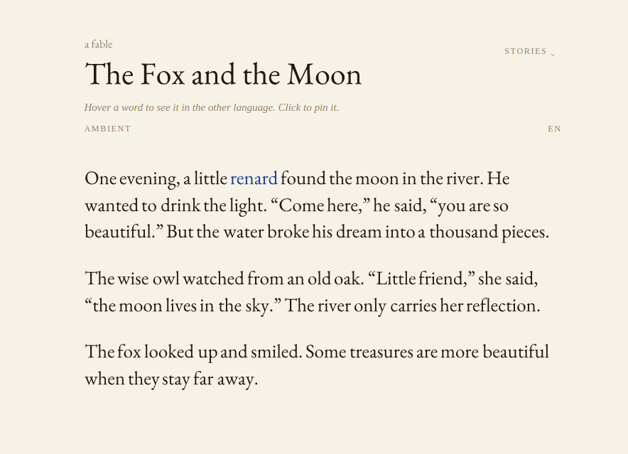
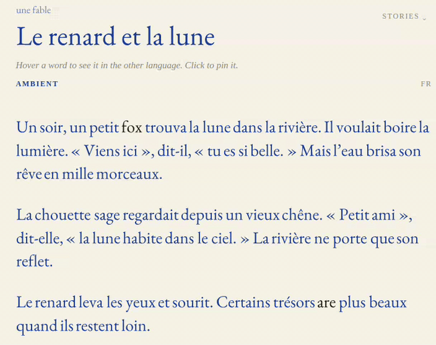

# Magic Font - stories that drift between languages

Interactive language learning through reading: bilingual stories whose words are
not fixed glyphs but living vector shapes that **morph smoothly between English
and French** - the same idea as manim's shape transformations in 3blue1brown
videos, but live in the browser.

 


## Run it

```bash
npm install
npm run dev      # needs Node 20+ (e.g. `nvm use 24`)
```

Then open the printed URL. For installing node , see [official website](https://nodejs.org/en/download).

- **Hover** a word and it flows into the *other* language; leave it and it flows back.
- **Click** a word and pin it in the other language
- **Ambient** mode morphs random words back and forth while you read, like a magical book

## How it works

A font *is* a vector graphic. For each aligned token pair (`fox` <--> `renard`):

1. **Outline extraction** - [`opentype.js`](https://github.com/opentypejs/opentype.js)
   renders each word to Bézier path data (with kerning) and splits it into
   closed contours ("cat" has 4: c, a-outer, a-hole, t). Font: EB Garamond
   (full French accent coverage).
2. **Contour pairing** - both contour lists are sorted left-to-right and paired;
   [`flubber`](https://github.com/veltman/flubber) builds a smooth interpolator
   for each pair. Unmatched contours *grow from* / *shrink to* a tiny circle at
   their own centroid, so extra letters appear and vanish instead of popping.
3. **Smooth differentiable timing** - the morph parameter runs through
   **smootherstep** $6t^5 - 15t^4 + 10t^3$, which is $C^2$-continuous: zero velocity
   *and* zero acceleration at both endpoints. See [wiki](https://en.wikipedia.org/wiki/Smoothstep).
4. **Fluid reflow** - each word is an inline `<svg>` whose width interpolates
   between the two advance widths with the same easing, so the paragraph
   reflows as words change length (`dog` <--> `chien`).

At exactly `t = 0` and `t = 1` the words snap to the true Bézier outlines, so
resting text is always crisp. Still not perfect, but a good place to start.

## Adding stories

Edit `src/stories.js`: each story is `{ id, genre, title, paragraphs }` where
`genre` and `title` are `{ en, fr }` pairs (they morph too) and each paragraph
is a list of `{ en, fr }` tokens. Where word order differs between the
languages, make the whole phrase one morphing unit
(e.g. `{ en: 'wise owl', fr: 'chouette sage' }`). A `{ br: true }` token forces
a line break, and `verse: true` tightens line spacing - see *Autumn Song*.

## Roadmap

Ideas to make authoring new stories faster, not yet implemented:

* **Dictionary-assisted translation** - plug a bilingual lexicon (e.g. Apertium's
  en-fr dictionary, Wiktionary extracts) into an authoring script that suggests
  a first-draft FR translation for typed EN text. Word-level dictionaries lack
  sense disambiguation and idiom handling, so treat output as a draft for human
  review, not a runtime translator - `stories.js` phrasing (word order, meter)
  still needs a human pass.
* **Synonym morph within one language** - generalize `WordMorph` from two fixed
  endpoints (`en`, `fr`) to an ordered chain of near-synonyms, e.g.
  `cold -> chilly -> brisk -> freezing -> arctic -> icy`. The existing
  contour-pairing / grow-shrink-to-circle machinery in `morph.js` already
  handles arbitrary contour-count mismatches between adjacent pairs, so this is
  mostly a data-shape change (list instead of `{en, fr}`) rather than a new
  morph algorithm. Source candidates from WordNet or a curated list; would let
  ambient drift wander through a meaning gradient instead of just EN/FR.
* **Small local LLM for authoring, not runtime** - run a small model (e.g.
  Gemma4 via Ollama) offline as a CLI to (1) propose sense-correct FR
  translations respecting register/meter for a given EN sentence, and (2) rank
  synonym candidates by semantic closeness to seed the ordered list above.
  Keep it out of the shipped bundle: this app is deliberately dependency-light
  at runtime (`opentype.js` + `flubber` only, no backend); the LLM would write
  suggested `stories.js` entries for a human to accept/edit, not run in the
  browser.


### Known Issues

* Flickering for long words in the *other* language. Introduce a cooldown

### Contribution

* Thanks to Claude it was easy to bring this idea of mine into live